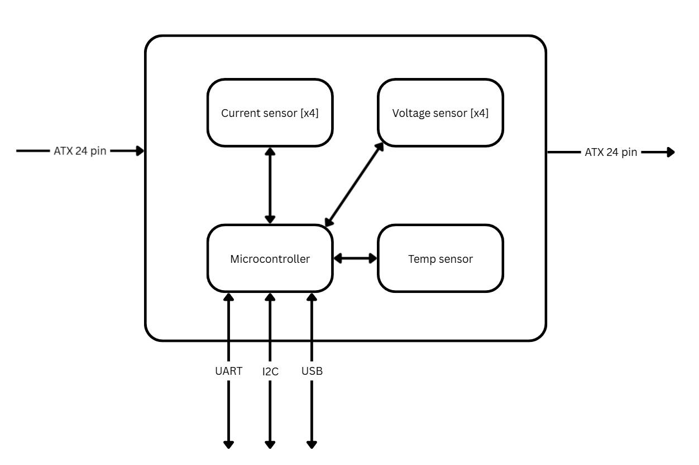

# ATX 24-Pin Inline Power Monitoring Board

A hardware module that sits inline between a desktop ATX power supply and motherboard, transparently passing all power rails through while simultaneously monitoring voltage, current, and temperature in real time.



---

## Overview

This board is designed as a non-intrusive power monitoring solution for ATX desktop systems. It connects via the standard 24-pin ATX connector and passes all rails through to the motherboard without modification, while sampling key electrical parameters and exposing them over multiple communication interfaces.

The design crosses three engineering domains — **power sensing**, **microcontroller firmware**, and **digital communications** — and is intended to demonstrate junior-to-mid level embedded hardware engineering capability.

---

## Features

- **Inline ATX 24-pin pass-through** — no modifications to the host system required
- **4-channel voltage monitoring** — measures +3.3V, +5V, +12V, and −12V rails
- **4-channel current monitoring** — measures current on each of the above rails
- **On-board temperature sensor** — monitors PCB/PSU thermal conditions
- **Microcontroller with three communication interfaces:**
  - UART
  - I²C
  - USB (also usable for MCU programming)
- **ATX PS_ON control** — microcontroller can toggle the power supply on/off
- **5VSB-powered MCU** — remains active even when the main rails are off
- **PWR_OK LED indicator** — shows live power supply status

---

## Design Specifications

| Rail   | Max Current (A) | Notes                          |
|--------|-----------------|--------------------------------|
| +3.3V  | 20 A            |                                |
| +5V    | 20 A            |                                |
| +12V   | 62 A            | Primary load rail              |
| −12V   | 0.3 A           | Requires special consideration |
| +5VSB  | 3 A             | Powers MCU in standby          |

*Reference: ATX Specification v2.2 and v3.2.1a*

---

## Project Files

The schematic and PCB layout were created in **KiCad**:

```
ATX_final/
├── ATX.kicad_sch       # Schematic
├── ATX.kicad_pcb       # PCB layout
├── ATX.kicad_pro       # Project file
└── ATX.kicad_prl       # Project local settings
```

---

## System Architecture

```
ATX PSU (24-pin) ──► [ Inline Monitoring Board ] ──► Motherboard (24-pin)
                              │
              ┌───────────────┼───────────────┐
              │               │               │
        Current [x4]    Voltage [x4]    Temp Sensor
              │               │               │
              └───────────────┼───────────────┘
                              │
                       Microcontroller
                      ┌───┬──────┬────┐
                    UART  I²C   USB  PS_ON
```

---

## Getting Started

### Prerequisites

- [KiCad 7+](https://www.kicad.org/) to view or modify the schematic and PCB
- ATX Specification v2.2 / v3.2.1a (included in this repo as reference)

### Opening the Project

1. Clone the repository
2. Open KiCad and load `ATX_final/ATX.kicad_pro`
3. Launch the schematic editor or PCB layout from the project manager

---

## Author

**Kazmir Fahrier**
- GitHub: [@KazmirFahrier](https://github.com/KazmirFahrier)
- LinkedIn: [kazmir-fahrier](https://www.linkedin.com/in/kazmir-fahrier)

---

## License

This project is open source. Feel free to use, modify, and build upon it with attribution.
