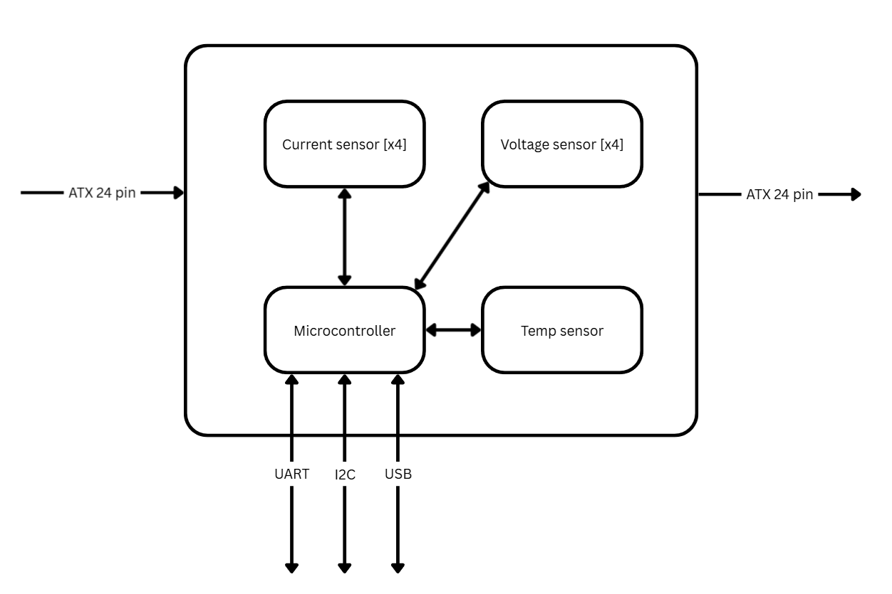

# ATX 24-Pin Inline Power Monitoring Board

A hardware module that sits inline between a desktop ATX power supply and the motherboard,
passing every power rail straight through while monitoring voltage, current and temperature.



**Scope:** schematic capture in KiCad, driven to a clean Electrical Rule Check. This is a
schematic-stage design — there is no PCB layout in this repository.

---

## What it does

The board connects through the standard 24-pin ATX connector and passes all rails to the
motherboard unmodified, so the host system needs no changes. It samples the electrical
parameters on each rail and exposes them over three interfaces.

- **Inline 24-pin pass-through** — two ATX connectors, every signal and power rail carried
  straight from input to output
- **4-channel voltage and 4-channel current monitoring** on +3.3 V, +5 V, +12 V and −12 V
- **On-board temperature sensing**
- **Three host interfaces** — UART, I²C and USB, with USB also able to program the MCU
- **+5 VSB-powered MCU**, so monitoring stays alive when the main rails are off
- **ATX PS_ON control** — the MCU can switch the supply on and off
- **PWR_OK status LED**

## Implementation

| Function | Part | Notes |
|---|---|---|
| Current and bus-voltage sensing | **INA219** | I²C, one per rail |
| Temperature | **TMP102** | I²C |
| Microcontroller | **ESP32-S3-WROOM-1** | UART, I²C and USB all native |
| Standby regulation | **AP2112K-3.3** | fed from +5 VSB |
| PS_ON control | **2N3904** | open-collector pull-down |
| −12 V conditioning | **MCP6001** | see below |

Around 62 components: 13 ICs, 23 resistors, 13 capacitors, 9 connectors, 2 transistors,
2 diodes, with bypass capacitors per each device's datasheet.

### The −12 V rail

The −12 V rail is the one part of this that needs thought. An INA219 measures with respect to
its own ground and cannot read a negative rail directly, so that channel is conditioned through
an MCP6001 stage to bring the measurement into the ADC's range rather than being left out or
assumed away. The other three rails are read directly.

### Sizing

Components are chosen against the real ATX current envelope rather than nominal values:

| Rail | Max current | Note |
|---|---|---|
| +3.3 V | 20 A | |
| +5 V | 20 A | |
| +12 V | **62 A** | primary load rail |
| −12 V | 0.3 A | needs the conditioning stage above |
| +5 VSB | 3 A | powers the MCU in standby |

Pin assignments and rail limits follow the **ATX Specification, versions 2.2 and 3.2.1a**. Those
documents are not redistributed here — refer to the published specifications.

## Files

```
.
├── README.md
├── LICENSE
├── ATX.kicad_sch     # schematic
├── ATX.kicad_pro     # project
├── ATX.kicad_prl     # local project settings
└── overview.png      # block diagram
```

## Opening it

Requires [KiCad](https://www.kicad.org/) 7 or later.

```bash
git clone https://github.com/KazmirFahrier/ATX-24-Pin-Inline-Power-Monitoring-Board.git
cd ATX-24-Pin-Inline-Power-Monitoring-Board
```

Open `ATX.kicad_pro` in KiCad and launch the schematic editor. Symbols are not footprint-assigned,
since the design stops at the schematic stage.

## Author

**Kazmir Fahrier** — [@KazmirFahrier](https://github.com/KazmirFahrier) ·
[linkedin.com/in/kazmir-fahrier](https://www.linkedin.com/in/kazmir-fahrier)

## License

MIT — see [LICENSE](LICENSE).
